# 🏗️ BookTrackr - System Architecture Diagram

## 📊 **High-Level System Architecture**

```mermaid
graph TB
    subgraph "🌐 External Services"
        GB[Google Books API]
        FIREBASE[Firebase Suite]
        GOOGLE[Google Sign-In]
    end
    
    subgraph "📱 Flutter App"
        subgraph "🎨 Presentation Layer (UI)"
            HOME[Home Screen]
            BOOKS[Book Screens]
            AUTH[Auth Screens]
            SOCIAL[Social Screens]
            ANALYTICS[Analytics Screens]
            MEETINGS[Meeting Screens]
        end
        
        subgraph "🔄 State Management"
            RIVERPOD[Riverpod Providers]
            AUTH_PROVIDER[Auth Provider]
            BOOKS_PROVIDER[Books Provider]
            SOCIAL_PROVIDER[Social Provider]
        end
        
        subgraph "🏛️ Domain Layer (Business Logic)"
            subgraph "📚 Book Domain"
                BOOK_ENTITY[Book Entity]
                BOOK_USECASES[Book Use Cases]
                BOOK_REPO[Book Repository Interface]
            end
            
            subgraph "🔐 Auth Domain"
                USER_ENTITY[User Entity]
                AUTH_USECASES[Auth Use Cases]
                AUTH_REPO[Auth Repository Interface]
            end
            
            subgraph "🤝 Social Domain"
                SOCIAL_ENTITY[Social Entity]
                SOCIAL_USECASES[Social Use Cases]
                SOCIAL_REPO[Social Repository Interface]
            end
        end
        
        subgraph "💾 Data Layer (Implementation)"
            subgraph "📡 Remote Data Sources"
                BOOK_REMOTE[Book Remote Data Source]
                AUTH_REMOTE[Auth Remote Data Source]
                SOCIAL_REMOTE[Social Remote Data Source]
            end
            
            subgraph "🏠 Local Data Sources"
                BOOK_LOCAL[Book Local Data Source]
                AUTH_LOCAL[Auth Local Data Source]
                SOCIAL_LOCAL[Social Local Data Source]
            end
            
            subgraph "🏪 Repositories"
                BOOK_REPO_IMPL[Book Repository Impl]
                AUTH_REPO_IMPL[Auth Repository Impl]
                SOCIAL_REPO_IMPL[Social Repository Impl]
            end
        end
        
        subgraph "🔧 Core Services"
            API_SERVICE[API Service]
            CACHE_SERVICE[Cache Service]
            AUTH_SERVICE[Auth Service]
            ANALYTICS_SERVICE[Analytics Service]
        end
    end
    
    subgraph "🗄️ Local Storage"
        HIVE[Hive Database]
        PREFS[SharedPreferences]
        CACHE[Cache Storage]
    end
    
    %% Connections
    HOME --> RIVERPOD
    BOOKS --> RIVERPOD
    AUTH --> RIVERPOD
    SOCIAL --> RIVERPOD
    ANALYTICS --> RIVERPOD
    MEETINGS --> RIVERPOD
    
    RIVERPOD --> BOOK_USECASES
    RIVERPOD --> AUTH_USECASES
    RIVERPOD --> SOCIAL_USECASES
    
    BOOK_USECASES --> BOOK_REPO
    AUTH_USECASES --> AUTH_REPO
    SOCIAL_USECASES --> SOCIAL_REPO
    
    BOOK_REPO --> BOOK_REPO_IMPL
    AUTH_REPO --> AUTH_REPO_IMPL
    SOCIAL_REPO --> SOCIAL_REPO_IMPL
    
    BOOK_REPO_IMPL --> BOOK_REMOTE
    BOOK_REPO_IMPL --> BOOK_LOCAL
    AUTH_REPO_IMPL --> AUTH_REMOTE
    AUTH_REPO_IMPL --> AUTH_LOCAL
    SOCIAL_REPO_IMPL --> SOCIAL_REMOTE
    SOCIAL_REPO_IMPL --> SOCIAL_LOCAL
    
    BOOK_REMOTE --> API_SERVICE
    AUTH_REMOTE --> AUTH_SERVICE
    SOCIAL_REMOTE --> API_SERVICE
    
    BOOK_LOCAL --> HIVE
    AUTH_LOCAL --> PREFS
    SOCIAL_LOCAL --> HIVE
    
    API_SERVICE --> GB
    AUTH_SERVICE --> FIREBASE
    AUTH_SERVICE --> GOOGLE
    
    CACHE_SERVICE --> CACHE
    CACHE_SERVICE --> PREFS
```

## 🔄 **Data Flow Architecture**

## 🏛️ **Clean Architecture Layers Detail**

## 🔐 **Authentication Flow Architecture**

```mermaid
graph TD
    subgraph "📱 User Interface"
        LOGIN[Login Screen]
        REGISTER[Register Screen]
        GOOGLE_BTN[Google Sign-In Button]
    end
    
    subgraph "🔄 State Management"
        AUTH_STATE[Auth State]
        AUTH_NOTIFIER[Auth Notifier]
    end
    
    subgraph "🏛️ Domain Layer"
        SIGNIN_UC[Sign In Use Case]
        SIGNUP_UC[Sign Up Use Case]
        AUTH_REPO[Auth Repository]
    end
    
    subgraph "💾 Data Layer"
        AUTH_REMOTE[Auth Remote Data Source]
        AUTH_LOCAL[Auth Local Data Source]
        FIREBASE_AUTH[Firebase Auth]
        GOOGLE_SIGNIN[Google Sign-In]
    end
    
    subgraph "☁️ External Services"
        FIREBASE[Firebase]
        GOOGLE[Google Services]
    end
    
    LOGIN --> AUTH_NOTIFIER
    REGISTER --> AUTH_NOTIFIER
    GOOGLE_BTN --> AUTH_NOTIFIER
    
    AUTH_NOTIFIER --> SIGNIN_UC
    AUTH_NOTIFIER --> SIGNUP_UC
    
    SIGNIN_UC --> AUTH_REPO
    SIGNUP_UC --> AUTH_REPO
    
    AUTH_REPO --> AUTH_REMOTE
    AUTH_REPO --> AUTH_LOCAL
    
    AUTH_REMOTE --> FIREBASE_AUTH
    AUTH_REMOTE --> GOOGLE_SIGNIN
    
    FIREBASE_AUTH --> FIREBASE
    GOOGLE_SIGNIN --> GOOGLE
    
    AUTH_LOCAL --> AUTH_STATE
    AUTH_REPO --> AUTH_STATE
```

## 📚 **Book Management System Architecture**

```mermaid
graph TB
    subgraph "🔍 Search & Discovery"
        SEARCH[Search Books]
        CATEGORIES[Browse Categories]
        RECOMMENDATIONS[AI Recommendations]
        TRENDING[Trending Books]
    end
    
    subgraph "📖 Book Operations"
        ADD_BOOK[Add to Library]
        UPDATE_STATUS[Update Reading Status]
        RATE_BOOK[Rate & Review]
        ADD_TO_LIST[Add to Reading List]
    end
    
    subgraph "🏛️ Domain Logic"
        BOOK_ENTITY[Book Entity]
        BOOK_USECASES[Book Use Cases]
        BOOK_REPO[Book Repository]
    end
    
    subgraph "💾 Data Sources"
        GOOGLE_BOOKS[Google Books API]
        LOCAL_CACHE[Local Cache]
        USER_LIBRARY[User Library]
    end
    
    subgraph "📊 State Management"
        BOOKS_STATE[Books State]
        BOOKS_PROVIDER[Books Provider]
        RECOMMENDATION_PROVIDER[Recommendation Provider]
    end
    
    SEARCH --> BOOKS_PROVIDER
    CATEGORIES --> BOOKS_PROVIDER
    RECOMMENDATIONS --> RECOMMENDATION_PROVIDER
    TRENDING --> BOOKS_PROVIDER
    
    ADD_BOOK --> BOOKS_PROVIDER
    UPDATE_STATUS --> BOOKS_PROVIDER
    RATE_BOOK --> BOOKS_PROVIDER
    ADD_TO_LIST --> BOOKS_PROVIDER
    
    BOOKS_PROVIDER --> BOOK_USECASES
    RECOMMENDATION_PROVIDER --> BOOK_USECASES
    
    BOOK_USECASES --> BOOK_REPO
    BOOK_REPO --> GOOGLE_BOOKS
    BOOK_REPO --> LOCAL_CACHE
    BOOK_REPO --> USER_LIBRARY
    
    BOOKS_PROVIDER --> BOOKS_STATE
    RECOMMENDATION_PROVIDER --> BOOKS_STATE
```

## 🤝 **Social Features Architecture**

## 📊 **Analytics & Performance Architecture**

## 🔄 **Dependency Injection Architecture**

```mermaid
graph TD
    subgraph "🔧 DI Container (GetIt)"
        GETIT[GetIt Service Locator]
    end
    
    subgraph "🏛️ Domain Layer Dependencies"
        AUTH_UC[Auth Use Cases]
        BOOK_UC[Book Use Cases]
        SOCIAL_UC[Social Use Cases]
    end
    
    subgraph "💾 Data Layer Dependencies"
        AUTH_REPO[Auth Repository]
        BOOK_REPO[Book Repository]
        SOCIAL_REPO[Social Repository]
        AUTH_REMOTE[Auth Remote Data Source]
        BOOK_REMOTE[Book Remote Data Source]
        SOCIAL_REMOTE[Social Remote Data Source]
        AUTH_LOCAL[Auth Local Data Source]
        BOOK_LOCAL[Book Local Data Source]
        SOCIAL_LOCAL[Social Local Data Source]
    end
    
    subgraph "🔧 Core Services"
        API_SERVICE[API Service]
        CACHE_SERVICE[Cache Service]
        AUTH_SERVICE[Auth Service]
    end
    
    GETIT --> AUTH_UC
    GETIT --> BOOK_UC
    GETIT --> SOCIAL_UC
    
    AUTH_UC --> AUTH_REPO
    BOOK_UC --> BOOK_REPO
    SOCIAL_UC --> SOCIAL_REPO
    
    AUTH_REPO --> AUTH_REMOTE
    AUTH_REPO --> AUTH_LOCAL
    BOOK_REPO --> BOOK_REMOTE
    BOOK_REPO --> BOOK_LOCAL
    SOCIAL_REPO --> SOCIAL_REMOTE
    SOCIAL_REPO --> SOCIAL_LOCAL
    
    AUTH_REMOTE --> AUTH_SERVICE
    BOOK_REMOTE --> API_SERVICE
    SOCIAL_REMOTE --> API_SERVICE
    AUTH_LOCAL --> CACHE_SERVICE
    BOOK_LOCAL --> CACHE_SERVICE
    SOCIAL_LOCAL --> CACHE_SERVICE
```

## 🎯 **Key Architecture Principles**

### **1. Clean Architecture**
- **Separation of Concerns** - Clear boundaries between layers
- **Dependency Rule** - Dependencies point inward
- **Testability** - Easy to unit test each layer
- **Independence** - Framework independent business logic

### **2. SOLID Principles**
- **Single Responsibility** - Each class has one reason to change
- **Open/Closed** - Open for extension, closed for modification
- **Liskov Substitution** - Subtypes are substitutable
- **Interface Segregation** - Client-specific interfaces
- **Dependency Inversion** - High-level modules don't depend on low-level modules

### **3. Design Patterns**
- **Repository Pattern** - Abstract data access
- **Factory Pattern** - Object creation
- **Observer Pattern** - State management with Riverpod
- **Strategy Pattern** - Different data source strategies
- **Adapter Pattern** - External API integration

### **4. Performance Optimizations**
- **Lazy Loading** - Load data on demand
- **Intelligent Caching** - Cache-first with background refresh
- **Memory Management** - Efficient resource handling
- **Network Optimization** - Minimize API calls

---

## 🏆 **Architecture Benefits**

1. **Scalability** - Easy to add new features
2. **Maintainability** - Clear structure and separation
3. **Testability** - Each layer can be tested independently
4. **Flexibility** - Easy to swap implementations
5. **Performance** - Optimized data flow and caching
6. **Security** - Proper authentication and data protection
7. **User Experience** - Smooth, responsive interface
8. **Offline Support** - Works without internet connection

This architecture demonstrates **enterprise-grade software engineering** principles and shows the ability to build **scalable, maintainable applications** that can handle real-world complexity while maintaining code quality and performance.
